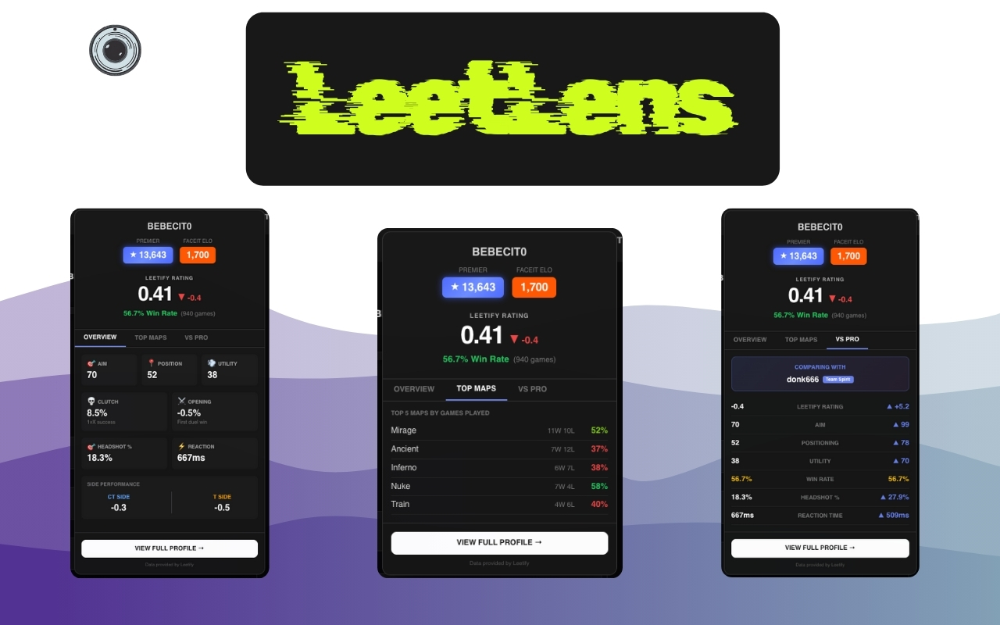
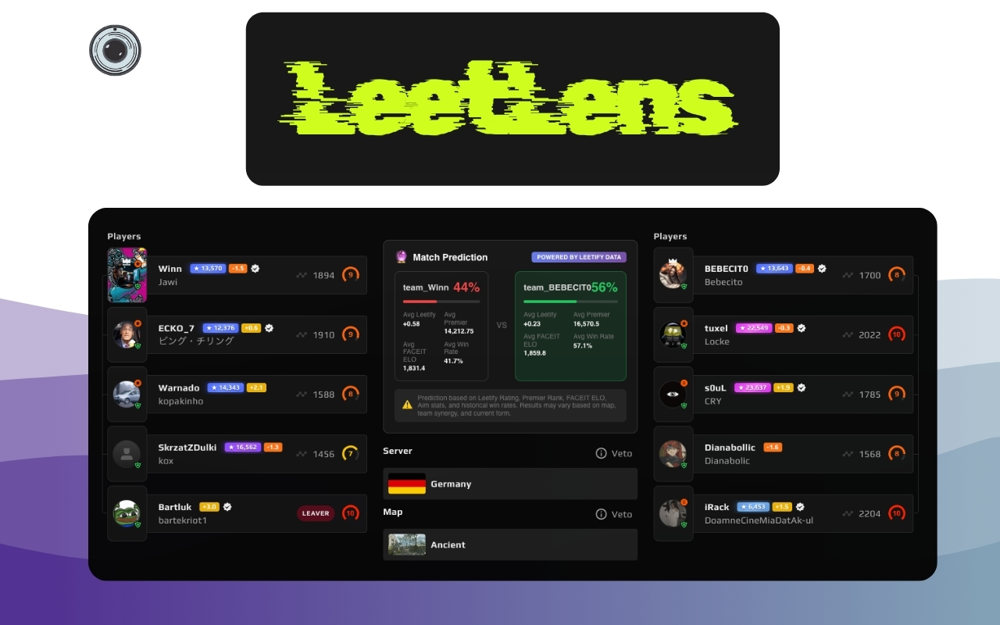

<p align="center">
  
</p>

# LeetLens

[](https://chromewebstore.google.com/detail/leetlens/ikiikldenmdehfaklhimpcccdpbckgcb)

A browser extension that enhances your FACEIT experience by integrating Leetify statistics, match predictions, and one-click demo uploads.

**[Install from Chrome Web Store](https://chromewebstore.google.com/detail/leetlens/ikiikldenmdehfaklhimpcccdpbckgcb)**

## Screenshots

<p align="center">
  
</p>

<p align="center">
  
</p>

## Features

### One-Click Demo Upload
Upload your FACEIT match demos to Leetify with a single click. No need to download files manually.

### Leetify Rating Badges
See Leetify ratings for all players directly on the FACEIT match page. Color-coded badges show skill levels at a glance:
- Green: Positive rating (+1.0 and above)
- Yellow: Neutral rating (0 to +1.0)
- Red: Negative rating (below 0)

### CS2 Premier Rank & FACEIT ELO
Premier ranks displayed with official Valve-style colors based on rating tier. FACEIT ELO shown alongside other stats.

### Match Win Prediction
Match predictions based on:
- Leetify ratings
- Premier ranks
- FACEIT ELO
- Aim statistics
- Map-specific win rates

### Detailed Stats Popup
Click any badge to view comprehensive player statistics:
- Aim, Positioning, Utility, Clutch ratings
- Opening duel performance
- Headshot percentage
- Reaction time
- CT/T side performance
- Top 5 maps with win rates

## Installation

### Chrome (Recommended)
**[Install from Chrome Web Store](https://chromewebstore.google.com/detail/leetlens/ikiikldenmdehfaklhimpcccdpbckgcb)**

### Chrome (Manual)
1. Download the latest release
2. Visit `chrome://extensions`
3. Enable "Developer mode"
4. Click "Load unpacked" and select the `dist/chrome` folder

### Firefox
1. Download the latest release
2. Visit `about:debugging`
3. Select "This Firefox" in the sidebar
4. Click "Load Temporary Add-on"
5. Select `dist/firefox/manifest.json`

## Usage

1. Navigate to any [FACEIT](https://www.faceit.com) match room page
2. **Match Prediction**: See the win probability panel at the top
3. **Upload Demos**: Click the gradient "Upload to Leetify" button
4. **View Ratings**: Leetify ratings, Premier ranks, and FACEIT ELO appear next to player names
5. **See Details**: Click any badge to open detailed stats

## Development

```bash
# Install dependencies
pnpm install

# Build the extension
pnpm build

# Development mode with hot reload
pnpm dev

# Format code
pnpm format
```

## Credits

This project is based on the [FACEIT to Leetify Demo Uploader](https://github.com/CSNADESgg/faceit-to-leetify-extension) by [CSNADES.gg](https://csnades.gg). We thank them for creating the original extension and making it open source.

Data provided by [Leetify](https://leetify.com).

## License

This extension is licensed under the [GPLv3](./LICENSE).

## Disclaimer

LeetLens is an independent project and is not affiliated with, endorsed by, or sponsored by FACEIT or Leetify. All trademarks, service marks, and company names are the property of their respective owners.

## Version History

- **v1.0.0** (January 2026)
  - Initial release of LeetLens
  - Leetify rating badges on player names
  - Premier rank display with Valve-style colors
  - FACEIT ELO display
  - Detailed stats popup with Overview and Top Maps tabs
  - Match win prediction panel
  - One-click demo upload to Leetify
  - Map-specific win rate support in predictions
